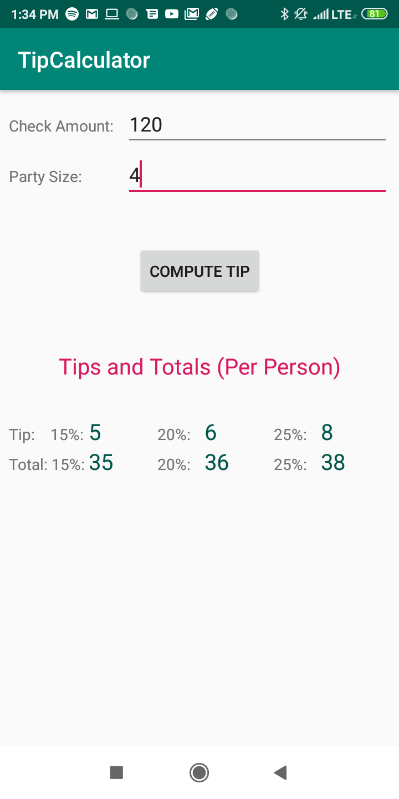

# Tip Calculator: How to use
1. Enter check total in check amount field
2. Enter number of people splitting the check in party size field
3. Press "Compute Tip" and you will see various resulting tip values per person as well as the total bill per person including each tip value.

### Note:
Negative values will be ignored and if you enter 0 or an empty string for either value you will see an appropriate error message in the form of a toast.

